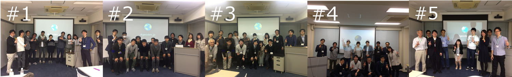
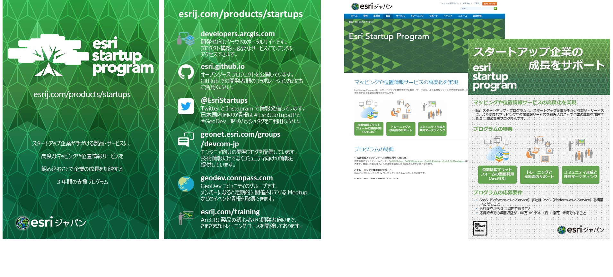

<!-- .slide: class="title" -->

## ArcGIS Developer セッション
#### ～あなたも GeoDev コミュニティと一緒に成長しよう！～
ESRIジャパン株式会社

---

<!-- .slide: class="agenda" -->

## プログラム

- ArcGIS Developer セッションとは
- 前半
  - GeoDev コミュニティの紹介
  - GeoDev LT
- BREAK
- 後半
  - ArcGIS を使った開発 -最新情報-
  - ArcGIS Runtime SDK for Xamarin
  - Esri スタートアップ プログラム
- 終わりに

---

<!-- .slide: class="section" -->

# ArcGIS Developer セッションとは

---

## 歴史

毎年開催しています。今年で 5 年目！
 - 2013 年：ソリューション開発__事例__
 - 2014 年：__開発者__のための GIS
 - 2015 年：__マルチ プラットフォーム__時代の最適な開発
 - 2016 年：__クラウド ファースト__時代の GIS アプリ開発事例
 - 2017 年：あなたも GeoDev __コミュニティ__と一緒に成長しよう！

---

## BREAK DEMO

BREAK も毎年趣向を凝らしたデモを披露してます！
 - 2013 年：なし
 - 2014 年：JavaScript/.NET 同機能アプリの同時デモ
 - 2015 年：観衆参加型フライトシミュレーター
 - 2016 年：Apple Watch でリアルタイム トラッキング
 - __2017 年：？__

---

## 2017年のテーマ「コミュニティ」

- あなたも GeoDev コミュニティと一緒に成長しよう！
  - GeoDev = Geo Developer
    - ミートアップ企画・運営
    - ハッカソン支援・参加
    - ソーシャルメディア（Twitter）
    - 開発ブログ（GeoNet）
    - 外部コミュニティとのコラボ

---

# GeoDev コミュニティの紹介

---

## ミートアップ企画・運営（GeoDev Meetup）

---

## ミートアップ企画・運営（GeoDev Meetup）

- もくもく会
- LT (ライトニングトーク)
- connpass で募集

---

## ミートアップ企画・運営（GeoDev Meetup）

- 毎月開催
  - 昨年 12 月から開始して 5 度開催
    - [GeoDev Meetup #5 - 地図データ可視化・アプリ作成もくもく会](https://geodev.connpass.com/event/53652/)

---

## ハッカソン支援・参加

- RESAS API ハッカソン（東京x2、島根、佐賀、岐阜）
- 室蘭市観光ハッカソン

---

## ハッカソン支援・参加

- [MUROSARU](https://esrijapan.github.io/photospot-finder/)
  - 室蘭市「企業・団体対抗 観光ハッカソン」公共クラウド賞
  - 総務省「公共クラウドアプリコンテスト」優秀賞
    - ArcGIS + Leaflet.js + React

---

## Twitter

- [#geodev_jp](https://twitter.com/search?f=tweets&vertical=default&q=%23geodev_jp&src=savs)
  - GeoDev Meetup 中継
  - ブログ新規記事の案内
  - その他いろいろ
    - コミュニティでのオープンな情報共有にお使いください！

---

## 開発ブログ（GeoNet）

- [弊社エンジニアが技術情報を発信しています！](https://geonet.esri.com/groups/devcom-jp/overview)

---

## 外部コミュニティとのコラボ

- JXUG（Xamarin）
  - [JXUG Xamarin ハンズオン！ ArcGIS を利用した地図アプリ開発](https://jxug.connpass.com/event/50809/)

---

# GeoDev LT

---

## GeoDev LT

- 「Tsuredatsu（つれだつ）」
  - [RESAS x Japan Hackathon](https://eventdots.jp/event/609481) 最優秀賞
  - 現在は事業化に向けてプロジェクト進行中！
    - [@Startup Hub Tokyo](https://startuphub.tokyo/)（東京都が運営する起業支援施設）

---

# BREAK

---

## みんなで遊べるゲームをつくったよ！

- 屋内測位 + ジオフェンス + リアルタイム送受信 = ？

---

## チーム構成

- ２チーム（A チーム、B チーム）に分かれます
  - プレイヤー（各チーム１人ずつ）
  - サポーター（プレイヤー以外全員）

<table>
<tr>
  <td rowspan="2"></td>
</tr>
<tr>
  <td>ジオフェンスアプリ（Aチーム）</td>
  <td>http://bit.ly/gcfgame_t1</td>
</tr>
</table>

---

## 同じチームのジオフェンスに入って得点を稼ごう！

- ルール
  - プレイヤーは共用廊下を歩きまわってもらいます
  - サポーターはジオフェンスを打ち込みまくってください（※5 秒に 1 回制限）
  - プレイヤーは自チームのジオフェンスに入ると加点 (+10) されます
  - プレイヤーは他チームのジオフェンスに入ると減点 (-5) されます

---

## 要素技術①：屋内測位

- Indoor Atlas

---

## 要素技術②：ジオフェンス

- ArcGIS GeoEvent Server

---

## 要素技術③：リアルタイム送受信

- WebSocket (`ws://`)

---

## 構成図

---

## 構成図

---

# ArcGIS を使った開発
## 最新情報

---

## 開発者向けサービス
 - 2017年3月より開発者向けのサービスが更新されました

---

## ArcGIS Developer Subscription

- 各プランには、ArcGIS Online Deployment Plan（50 クレジット/月）が付属します

---

## API/SDK

---
## ArcGIS API for JavaScript

---
## ArcGIS API for JavaScript
- 2017年4月にバージョン 4.3 を国内リリース
 - フィーチャの編集
 - シーン レイヤーのフィルタリング/クエリ機能
 - 点群レイヤーの操作（点の大きさと密度調整）
 - 新規ウィジェット追加（ベースマップ ギャラリー、スケールバー、展開）

 

---

## ArcGIS Runtime SDK
- 2017年1月にバージョン 100.0 を国内リリース
 - API の共通化（SDK 間の機能やリリース バージョンの差を解消）
 - ライセンス形態の変更
 - モバイルの 3D 対応（ベータ機能）、オフライン機能の強化、ベクター タイル レイヤー、ポータル連

---

## ArcGIS Runtime SDK
 - Xamarin API (ArcGIS Runtime SDK for .NET）が追加
   - Forms, iOS, Android 開発に対応
   - 国内サポート対応検討中

---

## ArcGIS Pro SDK
- 2017年5月にバージョン 1.4 を国内リリース
  - ArcGIS Pro UI にソリューション ブランディングを付加
   - カスタム スプラッシュ スクリーン、スタートアップ ページ、カスタム アイコンなど
  - ロール ベースのカスタマイズ
   - サインインした指定ユーザーのロールによるリボン UI 変更など

---

## ArcGIS API for Python
- 2016年12月に米国リリース
  - Python スクリプト による Web GIS の操作と自動化
   - データの可視化、ジオプロセシング ツールの実行、ポータル内のコンテンツ/ユーザーの管理、ビッグデータ解析
  - 実行環境: Jupyter Notebook
  - 国内サポート対応検討中

---

## 今後の予定（Esri）

- ArcGIS API for JavaScript
 - 4.4 (2017年7月) → 描画ツール、WMS/WMTS サービスのサポート
 - 4.5 (2017年Q3) → 編集ウィジェット
- ArcGIS Runtime SDK
 - 100.1 (2017年6月) → モバイル 3D 対応、各種レイヤーのサポート
 - 100.2 (2017年Q4) → ローカル コンテンツの拡充
- ArcGIS Pro SDK
 - 2.0 (2017年Q2) → Visual Studio 2017 対応（アセンブリに厳密名を採用するため、1.x で開発したアドインはコード修正が必要）
- ArcGIS API for Python
 - Web GIS のアップデートに併せた継続的なリリース

---

# ArcGIS Runtime SDK for Xamarin

---

# Esri スタートアップ・プログラム

---

## スタートアップ企業の成長をサポート

- Esri スタートアップ・プログラムは、スタートアップ企業が手がける製品・サービスに、より高度なマッピングや位置情報サービスを組み込むことで企業の成長を加速する3年間の支援プログラム

---

## Esri スタートアッププログラムの採用企業

---

## [Mapillary](https://www.mapillary.com/)
- スウェーデンのマルモにあるスタートアップが開発したジオタグ付きの写真を共有するサービス
- クラウドソーシング方式で街道に限らず世界中の場所を投稿できる
「ストリートビュー」をユーザーの手で作れる
- 日本の OSM コミュニティでも話題となった

---

## ブース展示

- [Esri Startup Program](https://www.esrij.com/products/startups/)

---

# 終わりに

---

<!-- .slide: class="geodev" -->

## GeoDev の今後

- GeoDev Meetup を全国に広めたい
  - 誰でも GeoDev イベントを開催できるようにガイダンス作ります！
  - 主催したい方がいれば私たちがサポートします！
- スタートアップや IoT といった新規領域でのアイデア共有
  - IoT x GIS Meetup？

---

<!-- .slide: class="end" -->

---

# おまけ：開発に困ったらどうする？

---

## ドキュメント
- 開発リソース集
  - 開発を始めるには、まずこちら

---

## サンプルコード
- Esri/Esri Japan GitHub
  - API/SDK ごとに豊富なサンプル

---

## コミュニティ
- GeoNet（Esri/ESRIジャパン）
- GeoDev Meetup

