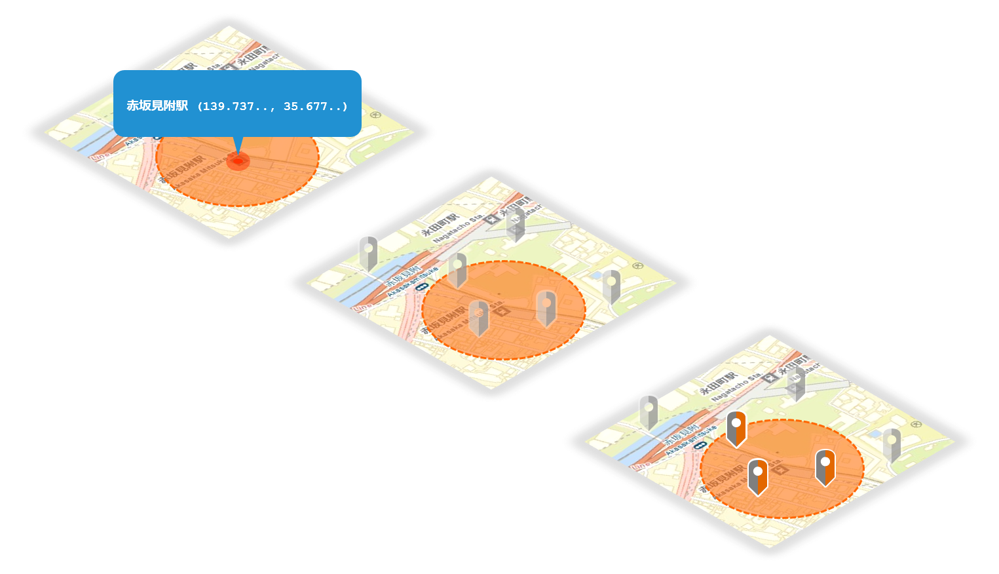
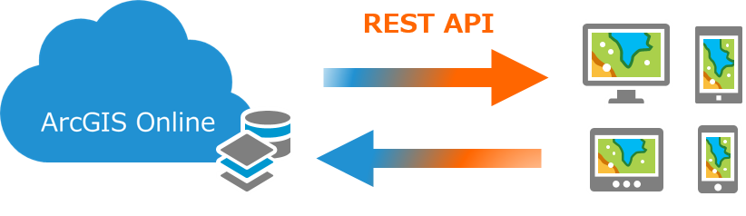
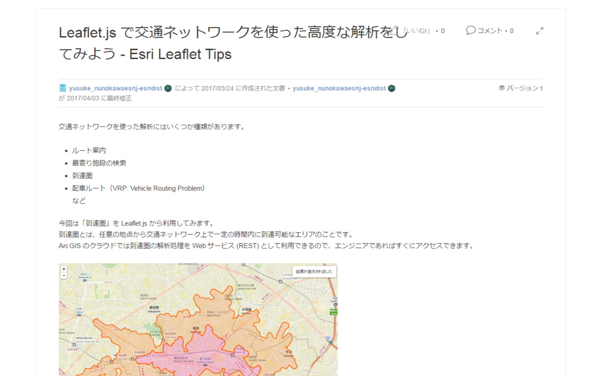

<!-- .slide: class="title" -->

## Leaflet.js で体験する ArcGIS Query API
#### GeoDev Meetup #5

<span style="font-size:0.7em;">[http://bit.ly/2o9YkEc](http://bit.ly/2o9YkEc)</span>

<a href="https://github.com/ynunokawa/geodev-presentations/tree/master/geodev-meetup-5/" target="_blank"></a>

---

<!-- .slide: class="agenda" -->

## 自己紹介

- #### ヌノカワユウスケ (<a href="https://twitter.com/_ynunokawa" target="_blank">@_ynunokawa</a>)
  - プロダクトマネージャー
  - 開発者向けプログラム、JavaScript API を担当
  - データ可視化やデザインが得意
  - 今年は React/Redux、WebGL をちゃんとやりたい

---

<!-- .slide: class="section" -->

# Leaflet.js

---

<!-- .slide: class="agenda" -->

## <a href="http://leafletjs.com/" target="_blank">Leaflet.js</a>

- Web ブラウザーで自由に動かせる地図を作るための JavaScriptライブラリ
  - オープンソース
  - (地図ライブラリにしては) 軽量でモバイルフレンドリー
  - ピュアな JavaScript で書かれてる
  - すべてのクラスは `L` というグローバル変数にぶら下がる (地図は `L.Map`)
  - プラグインがたくさん
  - Facebook, GitHub, Pinterest などで使われてる

---

## <a href="http://leafletjs.com/reference-1.0.3.html#map" target="_blank">L.Map</a>

<iframe src="demos/map.html" width="100%" height="600"></iframe>

---

## L.Map

地図を表示

```js
// 地図の初期化（id 属性が 'map' の <div> に展開）
const map = L.map('map', {
  center: [35.6792, 139.7606],
  zoom: 13
});

// 背景用の地図タイル (OpenStreetMap) を追加
L.tileLayer('http://{s}.tile.osm.org/{z}/{x}/{y}.png', {
    attribution: '&copy; <a href="http://osm.org/copyright">OpenStreetMap</a> contributors'
}).addTo(map);
```

---

## <a href="http://leafletjs.com/reference-1.0.3.html#marker" target="_blank">L.Marker</a>

<iframe src="demos/marker.html" width="100%" height="600"></iframe>

---

## L.Marker

地図にマーカーを追加

```js
// 地図にマーカーを追加、ポップアップの設定と表示
L.marker([35.6792, 139.7606])
    .addTo(map)
    .bindPopup('ここにテキストや DOM を記述できる')
    .openPopup();
```

---

## <a href="http://leafletjs.com/reference-1.0.3.html#icon" target="_blank">L.Icon</a>

<iframe src="demos/icon.html" width="100%" height="600"></iframe>

---

## L.Icon

マーカーを独自のアイコンで表示

```js
// アイコンの設定
var myIcon = L.icon({
		iconUrl: '../images/globe-icon-japan.png',
		iconSize: [64, 64],
		iconAnchor: [32, 32],
		popupAnchor: [-3, -23],
		shadowUrl: '../images/globe-icon-japan-shadow.png',
		shadowSize: [96, 64],
		shadowAnchor: [48, 32]
});

// マーカーにアイコン設定を追加
L.marker([35.6792, 139.7606], { icon: myIcon })
    .addTo(map)
    .bindPopup('ここにテキストや DOM を記述できる')
    .openPopup();
```

---

## <a href="http://leafletjs.com/reference-1.0.3.html#geojson" target="_blank">L.GeoJSON</a>

<iframe src="demos/geojson.html" width="100%" height="600"></iframe>

---

## L.GeoJSON

<a href="http://s.kitazaki.name/docs/geojson-spec-ja.html" target="_blank">GeoJSON</a> を読み込んで地図に表示

```js
// 外部の GeoJSON を取得 (jQuery じゃなくてもいいです)
$.getJSON('https://opendata.arcgis.com/datasets/507300cc932d4ca4bd2e5e7b0882d57f_0.geojson', function(data) {
  // GeoJSON を地図に追加
  L.geoJson(data, {
    // 各フィーチャにポップアップを設定
    onEachFeature: function (feature, layer) {
      layer.bindPopup(feature.properties.CSS_NAME + feature.properties.MOJI);
    }
  }).addTo(map);
});
```

---

<!-- .slide: class="section" -->

# ArcGIS Query API

---

## 空間的にデータを抽出したいときはどうすれば？

- たとえば...
  - 選択した都道府県内の学校だけを地図に表示したい
  - GPS 等で取得した現在位置の近くにある店舗情報を閲覧したい
  - 駅から徒歩○○分圏内の wifi スポットを探したい



---

## ArcGIS Quer API

- <a href="http://resources.arcgis.com/en/help/arcgis-rest-api/#/The_ArcGIS_REST_API/02r300000054000000/" target="_blank">ArcGIS REST API</a> オペレーションの１つ
- データの空間探索やってくれる
- WHERE 句による検索もできる
- GeoJSON で返してくれるので Leaflet.js で扱いやすい



---

## フィーチャ レイヤー

- ArcGIS の Web サービス（データ配信系）
- 実体はほぼ ArcGIS Query API と言っても差し支えない
- 可視化のためのメタ情報も持ってる
- 作ると勝手に Query API でデータ取れるようになるスグレモノ！
    - データベース要らない
    - API 書かなくていい
    - 空間データの扱いとか知らなくていい
    - 更新もできちゃう

---

## Query API を叩いてみよう

- リクエスト例
    - 練馬駅 (`geometry`) から
    - 半径 500 メートル (`distance`, `units`)
    - 以内に含まれる (`spatialRel`) データを
    - GeoJSON (`f`) で返す

<a href="https://jsfiddle.net/3uu5v1p3/2/" target="_blank">
```
https://services.arcgis.com/wlVTGRSYTzAbjjiC/arcgis/rest/services/
%E4%BF%9D%E8%82%B2%E5%9C%9223%E5%8C%BA/FeatureServer/0/
query?returnGeometry=true&where=1%3D1&outSr=4326&outFields=*&
geometry=139.65429881300054%2C35.73728805100046&geometryType=esriGeometryPoint&
spatialRel=esriSpatialRelIntersects&units=esriSRUnit_Meter&distance=500&
inSr=4326&f=geojson
```
</a>

---

## Leaflet.js で Query API を使うには

- <a href="https://esri.github.io/esri-leaflet/api-reference/layers/feature-layer.html" target="_blank">L.esri.FeatureLayer</a>
    - 地図への表示を前提とする
- <a href="https://esri.github.io/esri-leaflet/api-reference/tasks/query.html" target="_blank">L.esri.Query</a>
    - 地図への表示を前提としない、あるいはテンポラリーに表示したい（検索結果など）

---

## <a href="https://esri.github.io/esri-leaflet/api-reference/layers/feature-layer.html" target="_blank">L.esri.FeatureLayer</a>

<iframe src="demos/featurelayer.html" width="100%" height="600"></iframe>

---

## L.esri.FeatureLayer

フィーチャ レイヤーを地図に表示

```js
// フィーチャ レイヤー
L.esri.featureLayer({
	url: 'https://services1.arcgis.com/RVzd6I1g6h9fqyZM/arcgis/rest/services/streets/FeatureServer/0'
}).addTo(map);
```

---

## <a href="https://esri.github.io/esri-leaflet/api-reference/tasks/query.html" target="_blank">L.esri.Query</a>

<iframe src="demos/query.html" width="100%" height="600"></iframe>

---

## L.esri.Query

データを検索 (空間/属性)

```js
// 空間検索用クエリ
const query = L.esri.query({
	url: 'https://services.arcgis.com/wlVTGRSYTzAbjjiC/arcgis/rest/services/%E4%BF%9D%E8%82%B2%E5%9C%9223%E5%8C%BA/FeatureServer/0'
});
// 特定の中心座標から一定距離の円内に含まれるデータを検索
query.nearby(resultLatlng, r);
// クエリの実行
query.run(function(error, featureCollection, response){
    // クエリ結果の表示
    filterResults.addData(featureCollection);
});
```

---

## ブログ書いてます

- Leaflet.js x ArcGIS の Tips をブログで連載してます
  - <a href="http://arcg.is/2p07MyG" target="_blank">http://arcg.is/2p07MyG</a>



---

## おまけ：フィーチャ レイヤーの作り方

- ３通りくらいある
  1. ０から作る (シンボル、属性スキーマなどを設定)
  2. CSV, KML, シェープファイルなどをインポート
  3. 住所情報を座標変換 (ジオコーディング)


---


<!-- .slide: class="end" -->
